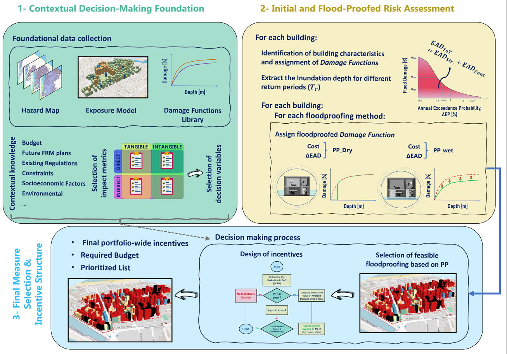

# Highlights Dataset: A Micro-Scale Framework for Evaluating the Cost-Effectiveness of Building-Level Floodproofing Measures

This repository contains machine-readable highlights of the study:

**FathiAzar, A., & De Angeli, S. (2025). A micro-scale framework for evaluating the cost-effectiveness of building-level floodproofing measures. Journal of Flood Risk Management, 18(3), e70126. https://doi.org/10.1111/jfr3.70126**

## Contents
- `highlights.md` – Plain text summary with bullet-point findings
- `highlights.json` – Structured dataset version for machine learning and automated parsing
- `LICENSE` – License for reuse CC-BY 4.0

## Purpose
This dataset provides concise highlights of the study in formats that are accessible to all.  
It is designed to support the easy sharing of key findings.

## Citation
If you use this dataset, please cite the original article and this repository:
FathiAzar, A., & De Angeli, S. (2025). A micro-scale framework for evaluating the cost-effectiveness of building-level floodproofing measures. Journal of Flood Risk Management, 18(3), e70126. 

## 🎥 Video Resource  

👀 Take a look at the short overview here: 

## -------------------

